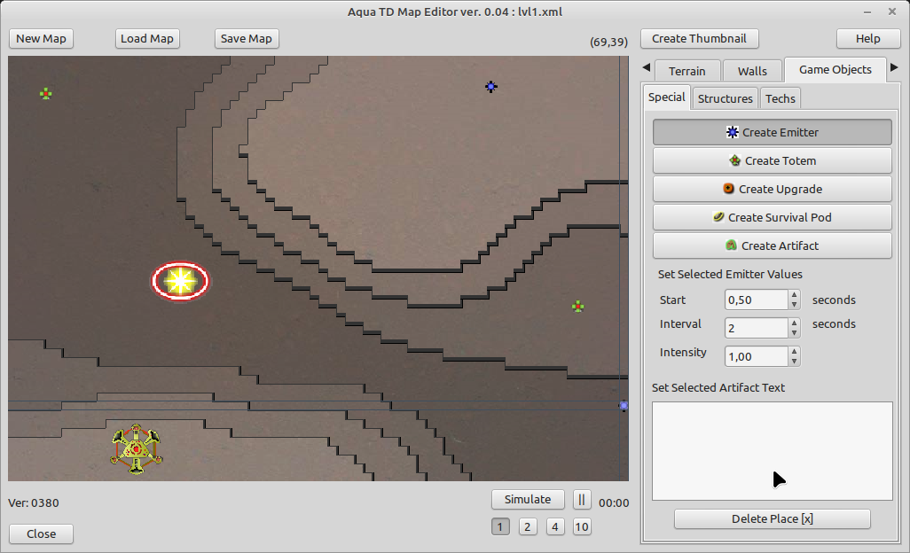

# CreeperWorld level Editor

I am a big fan of the orig [CreeperWorld](https://knucklecracker.com/creeperworld/cw.php) game from Knuckle Cracker.

There is a existing Leveleditor, but this one needs to have Adobe Air installed and even then, lots of people have problems installing and using it. So i did a quick research and wrote my own editor. 

Features:
- Load / Save *.cwm files (for CreeperWorld1 and Creeper World: Anniversary Edition)
- Create new levels
- Simulate "flow"

# How to use

Simple clone this repository and run the editor. Linux user may need to chmod +x the binary ;)